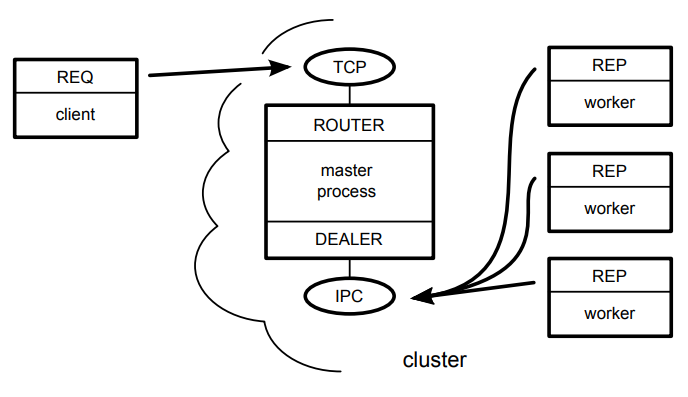

# ZMQ and higher-level messaging patterns.

Our master Node.js process will create ROUTER and DEALER sockets and
spin up the workers. Each worker will create a REP socket that connects back
to the DEALER.
The following figure illustrates how all these pieces fit together.
The rectangles represent Node.js processes. The ovals are the resources
bound by ØMQ sockets, and the arrows show which sockets connect to which
endpoin

